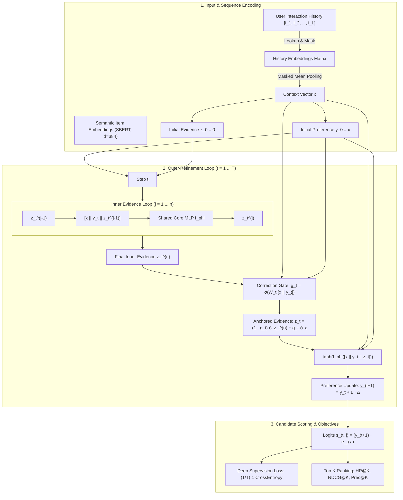

# ⚡ RefineRec: Iterative Latent Refinement for Sequential Recommendation

[](https://www.python.org/downloads/)
[](https://pytorch.org/)
[](https://lightning.ai/)
[](https://wandb.ai/olandechris-/refinerec/reports/RefineRec-Bayesian-Optimization-and-Five-Seed-Validation--VmlldzoxNzc5NjQwNA?accessToken=egmmekquwgr4ygitbfcg578evciwogl5q9br61ooksbnaenypd4qznvduncqizzh)
[](https://github.com/astral-sh/ruff)
[](LICENSE)

> RefineRec formulates sequential recommendation as an iterative latent preference trajectory problem, converging user intent through a dual-loop recurrent MLP with semantic item anchoring.

---

## 🎯 Highlights & Architectural Concepts

* 🔄 **Dual-Loop Latent Dynamics**: Decouples fast inner-loop evidence synthesis ($j = 1 \dots n$) from macro outer-loop preference trajectory updates ($t = 1 \dots T$).
* ⚓ **Evidence-Anchored Correction Gate**: Dynamically modulates state transitions via an input-dependent sigmoid gate $\mathbf{g}_t$, mitigating drift and anchoring predictions to historical user context.
* ⚡ **Shared Core MLP ($f_\phi$)**: Operates on a compact, parameter-efficient MLP shared across all recursion steps and both loops.
* 📈 **Multi-Step Deep Supervision**: Optimizes predictions across all intermediate refinement steps ($t = 1 \dots T$), enforcing monotonic ranking improvements and stable gradient flow.
* 🧠 **Zero Cold-Start Semantic Alignment**: Integrates 384-dimensional item semantic embeddings extracted from raw metadata via SentenceTransformers (`all-MiniLM-L6-v2`).
* 🛠️ **Production-Grade Lightning & HPO**: Equipped with `RefineRecDataModule`, `RefineRecLightning`, `EMACallback` ($\beta = 0.999$), automated W&B Bayesian Sweeps with Hyperband early termination, and pre-flight diagnostic suites.

---

## 🏗️ Architectural Workflow



---

## 📐 Mathematical Formulation

### 1. Input Context Encoding
Given an interaction history sequence $S = (i_1, i_2, \dots, i_{|S|})$ and item semantic embeddings $\mathbf{e}_i \in \mathbb{R}^d$:

$$\mathbf{x} = \frac{\sum_{i \in S} m_i \mathbf{e}_i}{\sum_{i \in S} m_i}, \quad \mathbf{y}_0 = \mathbf{x}, \quad \mathbf{z}_0 = \mathbf{0}$$

where $m_i \in \{0, 1\}$ denotes sequence validity mask indicators and $d = 384$.

### 2. Dual-Loop Latent Refinement
For outer refinement step $t \in \{1, \dots, T\}$:

* **Inner Evidence Synthesis ($j = 1, \dots, n$):**
  $$\mathbf{z}_t^{(j)} = f_\phi([\mathbf{x} \parallel \mathbf{y}_t \parallel \mathbf{z}_t^{(j-1)}])$$

* **Evidence-Anchored Correction Gate:**
  $$\mathbf{g}_t = \sigma(\mathbf{W}_t [\mathbf{x} \parallel \mathbf{y}_t])$$
  $$\mathbf{z}_t = (1 - \mathbf{g}_t) \odot \mathbf{z}_t^{(n)} + \mathbf{g}_t \odot \mathbf{x}$$

* **Residual Preference Trajectory Update:**
  $$\mathbf{y}_{t+1} = \mathbf{y}_t + L \cdot \tanh(f_\phi([\mathbf{x} \parallel \mathbf{y}_t \parallel \mathbf{z}_t]))$$

Where:
* $f_\phi: \mathbb{R}^{3d} \to \mathbb{R}^d$ is a depth-$D$ multilayer perceptron with LayerNorm and ReLU activations, shared across all recursive evaluations.
* $\mathbf{W}_t \in \mathbb{R}^{d \times 2d}$ is a step-specific linear gating transformation.
* $L$ denotes the preference residual scaling factor ($L = 1.0$).

### 3. Candidate Scoring & Multi-Step Deep Supervision
For a candidate set of item embeddings $\{\mathbf{e}_j\}_{j=1}^K$ ($1$ ground truth target + $K-1$ sampled negatives) and temperature $\tau$:

$$s_{t, j} = \frac{\mathbf{y}_{t+1}^\top \mathbf{e}_j}{\tau}$$

$$\mathcal{L}_{\text{total}} = \frac{1}{T} \sum_{t=1}^T \mathcal{L}_{\text{CE}}(\mathbf{s}_t, \text{target})$$

---

## 📈 Empirical Results & Multi-Seed Diagnostics

> 📊 **Interactive W&B Benchmark Report:** View complete training dynamics, learning rate & gradient diagnostics, and multi-seed convergence curves in the [RefineRec Bayesian Optimization & Five-Seed Validation Report](https://wandb.ai/olandechris-/refinerec/reports/RefineRec-Bayesian-Optimization-and-Five-Seed-Validation--VmlldzoxNzc5NjQwNA?accessToken=egmmekquwgr4ygitbfcg578evciwogl5q9br61ooksbnaenypd4qznvduncqizzh).

### 1. Optimal Hyperparameters (Bayesian Optimization)
Discovered via Bayesian search with Hyperband early termination:

```json
{
  "learning_rate": 0.00023275623934351656,
  "weight_decay": 0.00000767530048530261,
  "dropout": 0.1,
  "temperature": 0.5695201251085029,
  "preference_scale": 0.10364724283518208,
  "batch_size": 128,
  "core_depth": 6,
  "ema_decay": 0.999,
  "grad_clip": 3.0,
  "inner_steps": 4,
  "outer_steps": 3
}
```

### 2. Five-Seed Validation Diagnostics
Evaluated across 5 independent random seeds using the optimal Bayesian configuration:

| Seed | Run ID | Best NDCG@10 | Terminal NDCG@10 | Best Epoch | Epochs Completed |
| :---: | :---: | :---: | :---: | :---: | :---: |
| 42 | `wulq23cc` | 0.57114 | 0.57114 | 39 | 40 |
| 43 | `66ozl5pr` | 0.58612 | 0.58421 | 24 | 30 |
| 44 | `25s48rlx` | 0.59091 | 0.58660 | 17 | 23 |
| 45 | `rovxc1wb` | **0.59188** | **0.59064** | 12 | 18 |
| 46 | `04051a7l` | 0.58926 | 0.58736 | 15 | 21 |
| **Mean ± Std** | — | **0.58586 ± 0.00761** | **0.58399 ± 0.00681** | — | — |

> **Checkpoint Retention Diagnostic:** The mean best-to-terminal drop is **0.00187**, with a maximum of **0.00431**. Best-checkpoint retention is therefore appropriate and highly stable for reporting and deployment evaluation.

---

## 📂 Repository Layout

```
.
├── .gitattributes                       # Linguist language override
├── pyproject.toml                       # Build system, package metadata, and dependency specs
├── README.md                            # Comprehensive architectural documentation
├── RefineRecLightning.ipynb             # Self-contained, executable Jupyter notebook
├── sweep.yaml                           # W&B Bayesian Sweep & Hyperband configuration
└── refinerec/                           # Modular production package
    ├── __init__.py                      # Public API exports
    ├── callbacks.py                     # Exponential Moving Average callback (EMACallback)
    ├── config.py                        # Dataclass hyperparameters (RefineRecConfig)
    ├── data.py                          # Causal pair generation, negative sampling, DataModule
    ├── diagnostics.py                   # Invariant audit & single-batch sanity check
    ├── embeddings.py                    # Offline SBERT metadata embedding extraction
    ├── hpo.py                           # W&B Bayesian Sweep & Hyperband HPO search
    ├── lightning_module.py              # PyTorch Lightning module (RefineRecLightning)
    ├── losses.py                        # Multi-step deep supervision cross-entropy loss
    ├── metrics.py                       # Top-K ranking evaluation metrics (HR@k, NDCG@k, Prec@k)
    ├── modules.py                       # Core PyTorch modules (InputEncoding, CoreRecursionMLP, RefineRec)
    ├── sweep.yaml                       # Packaged sweep configuration
    └── train.py                         # End-to-end training pipeline and CLI entrypoint
```

---

## 🚀 Getting Started

### Installation

Clone the repository and install in editable mode:

```bash
git clone https://github.com/Chrisolande/recursive-refinement-recsys.git
cd recursive-refinement-recsys

# Install via pip
pip install -e .

# Or install via uv
uv pip install -e .
```

### Pretrained Item Feature Extraction

To extract 384-dimensional dense semantic vectors from text metadata:

```python
from refinerec.embeddings import extract_sbert_item_embeddings

extract_sbert_item_embeddings(
    interaction_path="data/Luxury_Beauty_5.txt",
    metadata_path="data/Luxury_Beauty_5_text_name_dict.pkl",
    output_path="data/sbert_item_embeddings.pt",
    model_name="sentence-transformers/all-MiniLM-L6-v2",
)
```

---

## ⚡ Training & Evaluation Workflows

### 1. Command Line Interface (CLI)
Execute full training with pre-flight invariant checks and validation:

```bash
# Using installed entrypoint
refinerec-train

# Or directly via python module
python -m refinerec.train
```

### 2. Standalone Jupyter Notebook
An end-to-end executable notebook containing data ingestion, model architecture, training loop, and evaluation charts is available at [`RefineRecLightning.ipynb`](RefineRecLightning.ipynb).

### 3. Programmatic Lightning Pipeline

```python
import pytorch_lightning as pl
import torch
from refinerec import (
    EMACallback,
    RefineRecConfig,
    RefineRecDataModule,
    RefineRecLightning,
    generate_causal_interaction_pairs,
    load_user_sequences,
)

# 1. Hyperparameter Configuration
config = RefineRecConfig(
    embedding_dim=384,
    outer_steps=7,
    inner_steps=3,
    core_depth=5,
    candidate_size=100,
    learning_rate=1e-3,
    batch_size=512,
    max_epochs=50,
    ema_decay=0.999,
)

# 2. Ingest Data & Setup DataModule
user_sequences = load_user_sequences("data/Luxury_Beauty_5.txt")
item_embeddings = torch.load("data/sbert_item_embeddings.pt")
train_pairs, val_pairs = generate_causal_interaction_pairs(user_sequences)

datamodule = RefineRecDataModule(
    train_pairs=train_pairs,
    val_pairs=val_pairs,
    num_items=item_embeddings.size(0),
    config=config,
)

# 3. Instantiate Lightning Model & Trainer
model = RefineRecLightning(
    pretrained_sbert_embeddings=item_embeddings,
    config=config,
)

trainer = pl.Trainer(
    max_epochs=config.max_epochs,
    callbacks=[EMACallback(decay=config.ema_decay)],
    accelerator="auto",
)

# 4. Train and Validate
trainer.fit(model, datamodule=datamodule)
trainer.validate(model, datamodule=datamodule)
```

### 4. Automated Hyperparameter Optimization (W&B Sweeps + Bayesian Optimization)

RefineRec integrates native W&B Sweeps configured via [`sweep.yaml`](sweep.yaml):

```python
from refinerec.hpo import run_hparam_search

# Launch native W&B Bayesian Sweep with Hyperband early termination
sweep_id = run_hparam_search(
    n_trials=40,
    search_epochs=15,
    project_name="refinerec",
    config_path="sweep.yaml",
)
print(f"Sweep completed. ID: {sweep_id}")
```

---

## ⚙️ Configuration Reference

All hyperparameters are centralized in `RefineRecConfig`:

| Parameter | Type | Default | Math Symbol | Description |
| :--- | :---: | :---: | :---: | : |
| `embedding_dim` | `int` | `384` | $d$ | Item semantic feature dimension |
| `max_history_length` | `int` | `50` | $L_{\max}$ | Maximum historical interaction sequence length |
| `outer_steps` | `int` | `7` | $T$ | Number of outer refinement iterations |
| `inner_steps` | `int` | `3` | $n$ | Number of inner recursive evidence updates |
| `core_depth` | `int` | `5` | $D$ | Depth of shared MLP core network $f_\phi$ |
| `preference_scale` | `float` | `1.0` | $L$ | Preference residual update step scale |
| `temperature` | `float` | `1.0` | $\tau$ | Candidate dot-product logit scaling factor |
| `candidate_size` | `int` | `100` | $K$ | Candidate evaluation pool size ($1 \text{ pos} + 99 \text{ neg}$) |
| `learning_rate` | `float` | `1e-3` | $\eta$ | Adam optimizer learning rate |
| `batch_size` | `int` | `512` | $B$ | Mini-batch size for training and validation |
| `max_epochs` | `int` | `50` | — | Maximum training epochs |
| `ema_decay` | `float` | `0.999` | $\beta$ | Exponential Moving Average decay factor |
| `freeze_item_embeddings` | `bool` | `False` | — | Freeze pretrained item embeddings during training |
| `num_workers` | `int` | `3` | — | DataLoader multiprocessing workers |
| `exclude_history_items_from_negatives` | `bool` | `True` | — | Filter past user interactions when sampling negatives |

---

## 📊 Evaluation Protocol

Evaluation adheres strictly to standard leave-one-out ranking protocol over sampled 100-item candidate pools ($1$ ground truth + $99$ uniform negatives):

* **Hit Ratio ($HR@K$)**:
  $$\text{HR}@K = \frac{1}{|U|} \sum_{u \in U} \mathbb{I}(\text{rank}_u \le K)$$

* **Normalized Discounted Cumulative Gain ($NDCG@K$)**:
  $$\text{NDCG}@K = \frac{1}{|U|} \sum_{u \in U} \frac{\mathbb{I}(\text{rank}_u \le K)}{\log_2(\text{rank}_u + 1)}$$

* **Precision ($Prec@K$)**:
  $$\text{Prec}@K = \frac{1}{|U|} \sum_{u \in U} \frac{\mathbb{I}(\text{rank}_u \le K)}{K}$$

All metrics are evaluated and reported across top-$K$ cutoffs $K \in \{1, 5, 10\}$.

---

## 📄 License

This project is open-source under the [MIT License](LICENSE).

